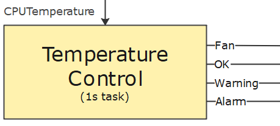

# Calculators

Calculators have no direct connection to the hardware, but communicate exclusively with the signal hub.

The calculators are called up in special calculator tasks. A calculator task first calls the calculator assigned to it in  `read` mode. This gives the calculator the opportunity to read signals from the signal hub. Once the signals have been read, the calculator is called up in `calculate` mode. In the last step, the calculator is called up in `write` mode and can now write the calculated values back to the signal hub.

## Temperature monitoring
In this part of the tutorial, we will add the temperature monitoring to our application in the form of a calculator.



The temperature monitoring requires the current CPU temperature as an input signal. Depending on the temperature, we set the status to `OK`, `Warning` or `Alarm`. If the system is in `Warning` or `Alarm` status, the fan should also be switched on. 

Create a new class `TemperatureMonitoring`.

```{literalinclude} assets/code/TemperatureMonitoring.cs
---
language: csharp
lines: 1-9,19-22,89
---
```

All input and output signals relevant for the calculator are available via the properties 'SignalSinks' (inputs) and 'SignalSources' (outputs).
The individual signals are accessed via an index, which must first be determined in the configuration phase.

To save the indices, we first add the following fields:

```{literalinclude} assets/code/TemperatureMonitoring.cs
---
language: csharp
lines: 13-17
---
```
In the next step, we overwrite the `OnConfigure()` method as follows:

```{literalinclude} assets/code/TemperatureMonitoring.cs
---
language: csharp
lines: 36-88
---
```

The indices of the individual signals currently correspond to their position in the configuration. However, this is not guaranteed and may change in future versions of SignalF. To determine the correct index, we therefore call the `GetSignalIndex()` method for each signal and then assign the returned index to the corresponding fields.

To finalise the temperature monitoring, we define the desired limit values and overwrite the `OnCalculate()` method.

```{literalinclude} assets/code/TemperatureMonitoring.cs
---
language: csharp
lines: 10-12,24-34
---
```

## Configuration
Once we have created the temperature monitoring component, we still need to register it in our application and configure the inputs and outputs. To do this, first create the extension method for registering the component.

```{literalinclude} assets/code/MonitoringExtensions.cs
---
language: csharp
lines: 1-13,48
---
```

Now open the file `Program.cs` and add a call to the extension method.

```{literalinclude} assets/code/Program.cs
---
language: csharp
lines: 20-29,33
emphasize-lines: 10
---
```

### Signal provider definition
In order to configure the monitoring component, you must first create a signal provider definition for the monitoring component. This definition is a description of the implementation that can be read by the SignalF controller and corresponds roughly to a class in object-orientated programming. Among other things, the definition contains a list of the signal sources and sinks.

```{literalinclude} assets/code/MonitoringExtensions.cs
---
language: csharp
lines: 21-33
---
```

### Signal provider configuration