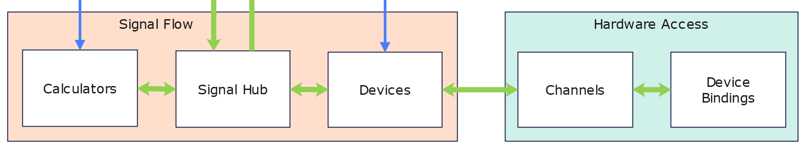

# GPIO Access

In the previous chapter, we created a component for temperature monitoring. In this component, the corresponding outputs are set depending on the CPU temperature.

In the rest of this chapter, I would like to explain how the temperature monitoring status is forwarded to the GPIO ports of the Raspberry Pi.


## Gpio Pin Access
The SignalF controller contains a hardware-independent abstraction of the GPIO ports. So that we can use this, we first create a new signal provider definition and a signal provider configuration. To do this, we add the following extension method:

```{literalinclude} assets/code/DeviceExtensions.cs
---
language: csharp
lines: 79-106
emphasize-lines: 21-24
---
```

As mentioned above, Gpio Pin Access is hardware-independent. However, so that we can control the hardware pins, we need a new method in addition to the methods used so far for configuring signal sources and sinks: ```AddSignalToChannelMapping```. 
This allows the virtual pins in Gpio Pin Access to be assigned to the real hardware pins. 

</br>
The following image shows an excerpt from the SignalF architecture overview.



In the ```Hardware Access``` block, we see the ```Device Bindings``` component. This component is responsible for establishing communication with the hardware (e.g. sensors) or with other measurement systems. The ```Signal Flow``` block contains the device-specific implementations such as Gpio or sensors such as the BME280. Communication between the device bindings and the device implementations takes place via protocol-specific but hardware-independent channels, which are combined in channel groups.

## Device binding

SignalF already contains a set of device bindings for the [.NET IoT Libraries](https://github.com/dotnet/iot/tree/main). This also includes the binding for Gpio, which we are using here.

The integration is quite simple. All we have to do is call the ```AddGpioDeviceBinding``` method in the SignalF configuration and specify a name for the binding.

```{literalinclude} assets/code/DeviceExtensions.cs
---
language: csharp
lines: 19-24
emphasize-lines: 3
---
```

The other two methods add the Gpio Pin Access configuration described above and the subsequent channel configuration. 


## Channels and channel groups

```{literalinclude} assets/code/DeviceExtensions.cs
---
language: csharp
lines: 26-76
---
```