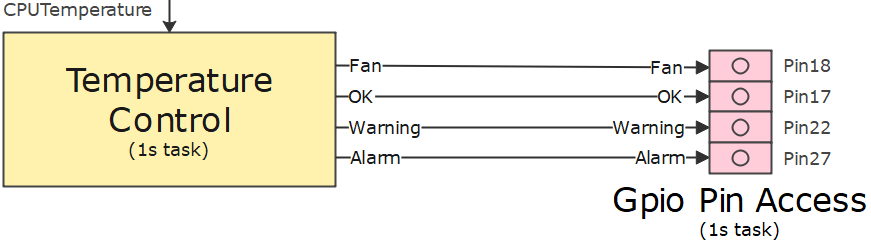

# GPIO Access

In the previous chapter, we created a component for temperature monitoring. In this component, the corresponding outputs are set depending on the CPU temperature.

In the rest of this chapter, I would like to explain how the temperature monitoring status is forwarded to the GPIO ports of the Raspberry Pi.

## Gpio Pin Access

## Channels and channel groups

## Device binding