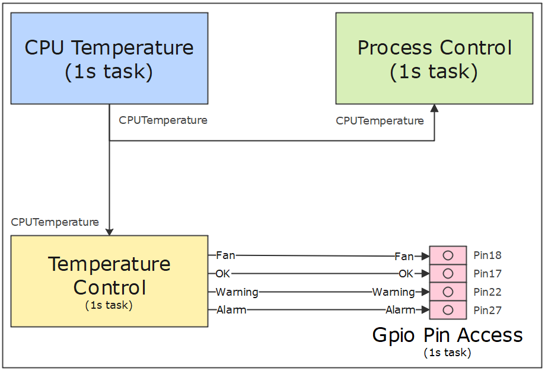

# CPU-Temperature

In this tutorial we will develop a simple temperature monitoring system with SignalF for the Raspberry Pi. Depending on the processor temperature, the system will control various LEDs and a fan to cool the processor. 

You will learn how to integrate devices and data output components into SignalF. We will also create a simple logic to monitor the temperature. In the last step, we will connect the individual components using configuration.

## Create the project

First create a new project for a .NET 8 console application.

:::{hint}
Further information on how to create a SignalF application can be found in the chapter [Getting started with SignalF](/getting-started/getting-started.md)
:::

